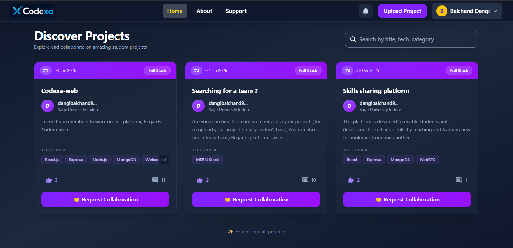
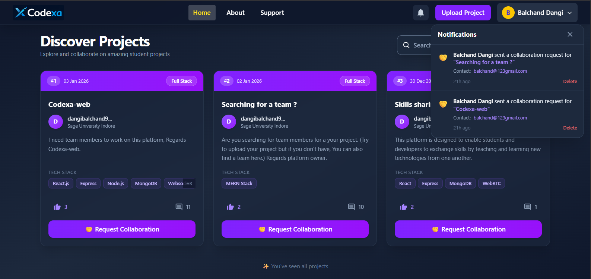
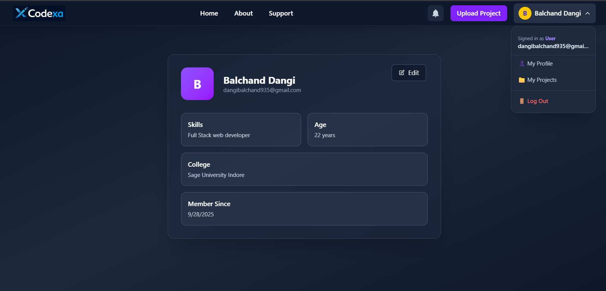
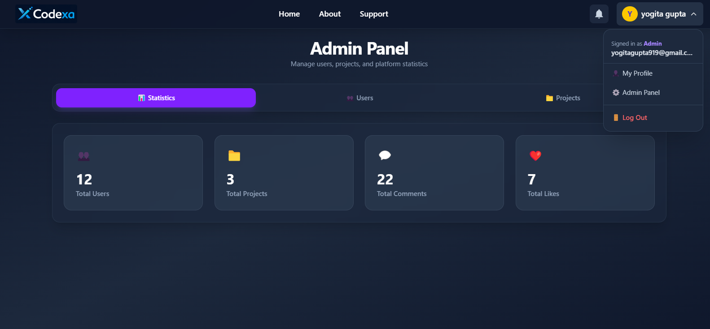
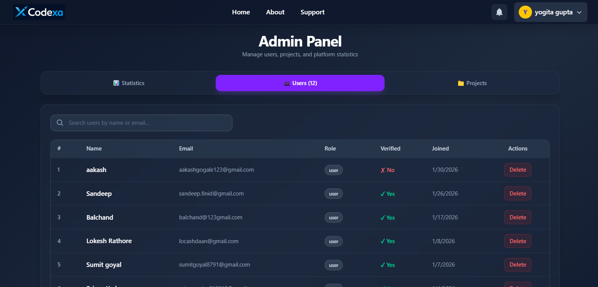

# 🚀 Codexa web - A Collaborative Project Showcase & Team Building Platform for Developers and Tech enthusiasts

Copyright (c) 2026 Balchand Dangi.

##  Overview

**Codexa web** is a full-stack web application that enables students and developers to showcase their projects, collaborate with team members, and discover innovative work from the community. Built with modern technologies, it provides a secure, scalable platform for project management and real-time collaboration.

---

## 📸 Screenshots

### 👤 User Module Features





 
 
 

### 🛡️ Admin Module Features

 
 


---## ✨ Key Features

### 🔐 Authentication & Security

- **Email Verification**: Secure signup with email verification tokens (24-hour expiry)
- **JWT Token-Based Auth**: Stateless authentication with 7-day expiry
- **HTTP-Only Cookies**: XSS attack prevention
- **Password Hashing**: bcryptjs with 10 salt rounds
- **Token Blacklisting**: Redis-based logout with token invalidation
- **Rate Limiting**: Strict and light rate limiters to prevent abuse
- **CSRF Protection**: SameSite cookie policy

### 📁 Project Management

- **Project Upload**: Share projects with detailed descriptions, tech stacks, and categories
- **Project Search & Discovery**: Browse all projects with filtering capabilities
- **My Projects**: Personal project dashboard with status tracking
- **Real-Time Updates**: Socket.IO for live project interactions

### 👥 Collaboration Features

- **Collaboration Requests**: Send and manage team collaboration invitations
- **Team Status Tracking**: Monitor team member progress on shared projects
- **Project Comments**: Real-time commenting system for discussions
- **Likes & Interactions**: Community engagement through likes and reactions

### 🔔 Notifications

- **Real-Time Notifications**: Socket.IO-based instant notifications
- **Collaboration Alerts**: Get notified when someone requests collaboration
- **Comment Notifications**: Receive updates on project comments
- **Notification Bell**: Visual indicator for unread notifications

### 👤 User Management

- **Profile Management**: Edit user information and skills
- **Admin Panel**: Administrative controls for user and project management
- **Role-Based Access**: User and Admin roles with different permissions
- **Password Reset**: Secure forgot password flow with email tokens

### ⚡ Performance & Optimization

- **Redis Caching**: Multi-layer caching strategy for improved performance
- **Database Indexing**: Optimized MongoDB queries
- **Pagination**: Efficient data loading for large datasets
- **Request Validation**: Frontend and backend validation layers

---

## 🛠️ Tech Stack

### **Backend**

- **Runtime**: Node.js
- **Framework**: Express.js 5.1
- **Database**: MongoDB 8.18
- **Cache**: Redis 5.11
- **Real-Time**: Socket.IO 4.8
- **Authentication**: JWT, bcryptjs
- **Email**: SendGrid/Nodemailer
- **Validation**: validator.js

### **Frontend**

- **Framework**: React 18+
- **Build Tool**: Vite
- **HTTP Client**: Axios
- **Routing**: React Router v6
- **Toast Notifications**: react-hot-toast
- **Styling**: Tailwind CSS
- **Socket.IO Client**: Socket.IO 4.8

### **Infrastructure**

- **Deployment**: Ready for Heroku, AWS, or any Node.js hosting
- **Environment**: .env configuration for all environments

---

## 📖 API Documentation

### Authentication Endpoints

#### Sign Up

```http
POST /api/auth/signUp
Content-Type: application/json

{
  "name": "John Doe",
  "email": "john@example.com",
  "password": "SecurePass123!",
  "age": 20,
  "skills": ["React", "Node.js"],
  "college": "MIT"
}
```

#### Sign In

```http
POST /api/auth/signIn
Content-Type: application/json

{
  "email": "john@example.com",
  "password": "SecurePass123!"
}
```

#### Verify Email

```http
GET /api/auth/verify-email/:token
```

#### Logout

```http
POST /api/auth/logOut
```

#### Forgot Password

```http
POST /api/auth/forgot-password
Content-Type: application/json

{
  "email": "john@example.com"
}
```

#### Reset Password

```http
POST /api/auth/reset-password/:token
Content-Type: application/json

{
  "newPassword": "NewSecurePass123!"
}
```

### Project Endpoints

#### Upload Project

```http
POST /api/uploadProject
Authorization: Bearer {token}
Content-Type: application/json

{
  "title": "AI Chat Application",
  "description": "A full-stack AI chatbot...",
  "techStack": ["React", "Node.js", "MongoDB"],
  "category": ["AI", "Web Development"],
  "college": "MIT"
}
```

#### Get All Projects

```http
GET /api/getProjects?page=1&limit=10&search=ai
```

#### Get User's Projects

```http
GET /api/my-projects?page=1&limit=10
Authorization: Bearer {token}
```

#### Get Project Details

```http
GET /api/project/:projectId
```

### More endpoints available in the codebase

---

## 🔐 Security Features

### Authentication Flow

1. User signs up with email verification
2. Email verification link (24-hour expiry) sent via SendGrid
3. JWT token generated on login (7-day expiry)
4. Token stored in HTTP-only, secure cookies
5. Every request verified server-side
6. Token blacklisted on logout
7. Automatic token validation on app initialization

### Data Protection

- Passwords hashed with bcryptjs (10 rounds)
- Sensitive data not exposed in API responses
- Email enumeration prevention in password reset
- CORS enabled for trusted origins only
- XSS protection via HTTP-only cookies
- CSRF protection via SameSite cookies

---

## 🧪 Testing

### Manual Testing Checklist

- [ ] User signup with email verification
- [ ] User login with verified email
- [ ] Password reset flow
- [ ] Project upload with validation
- [ ] Real-time notifications
- [ ] Collaboration requests
- [ ] Rate limiting on endpoints
- [ ] Token blacklist on logout
- [ ] Admin panel access

---

## 🐛 Known Issues & Future Improvements

### Future Features

- [ ] User badges and achievements
- [ ] Portfolio export as PDF
- [ ] GitHub integration for project import
- [ ] Team workspace creation
- [ ] Analytics dashboard
- [ ] Social features (follow users, trending projects)

---

## 📁 Project Structure

```
codexa/
├── backEnd/
│   ├── config/          # Database and Redis configuration
│   ├── controllers/     # Request handlers
│   ├── middleware/      # Custom middleware (auth, rate limiting)
│   ├── model/          # Mongoose schemas
│   ├── routers/        # API route definitions
│   ├── utils/          # Helper functions & validation
│   ├── server.js       # Express server setup
│   └── socket.js       # Socket.IO event handlers
├── frontEnd/
│   ├── src/
│   │   ├── Components/ # Reusable components
│   │   ├── Pages/      # Page components
│   │   ├── hooks/      # Custom React hooks
│   │   ├── assets/     # Static files
│   │   ├── App.jsx     # Main app component
│   │   └── main.jsx    # React entry point
│   ├── package.json
│   └── vite.config.js  # Vite configuration
└── README.md

```

## 📄 License

This project is licensed under the ISC License - see the LICENSE file for details.

---

## 👥 Team

**Project Owner**: Balchand Dangi  
**Repository**: [Codexa GitHub](https://github.com/Balchand-dangi/Codexa)

---

## 💬 Support

For support, email dangibalchand935@gmail.com

---

## 🎯 Performance Metrics

- **Average Response Time**: < 200ms
- **Cache Hit Rate**: 80%+
- **Uptime Target**: 99.9%
- **Database Query Optimization**: Indexed queries only
- **Real-Time Latency**: < 100ms

---

## 📞 Contact

- **Email**: dangibalchand935@gmail.com
- **GitHub**: [@Balchand-dangi](https://github.com/Balchand-dangi)

---
